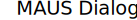

---
The dialogue font used in the book Maus by Art Spiegelman.

    

## Download
Download the TTF from the [Github Repo](https://github.com/MicahBird/maus-art-font/blob/main/Maus%20Dialogue.ttf?raw=true).

## Issues
- Letters with accents are currently not implemented.
- The font doesn't have consistent kerning.

## Credits
This project wouldn't have been possible without [ljudmila.org.](http://www.ljudmila.org/ciril/maus_test/index.html)

Thanks to [glyphtracer](https://github.com/jpakkane/glyphtracer) for making things easier!

Thanks to [Font Forge](https://fontforge.org/en-US/)!

The book 'Maus' is a copyrighted work and is not my original creation. All rights to the book, its characters, and images belong to the respective owners. This project is for educational and non-commercial use only and does not imply endorsement or affiliation with the original creators or owners.
